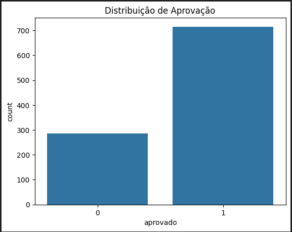
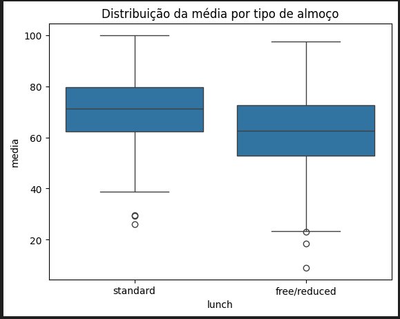
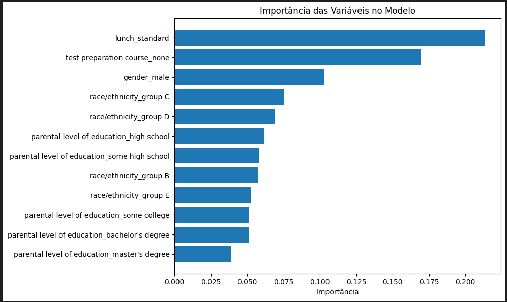
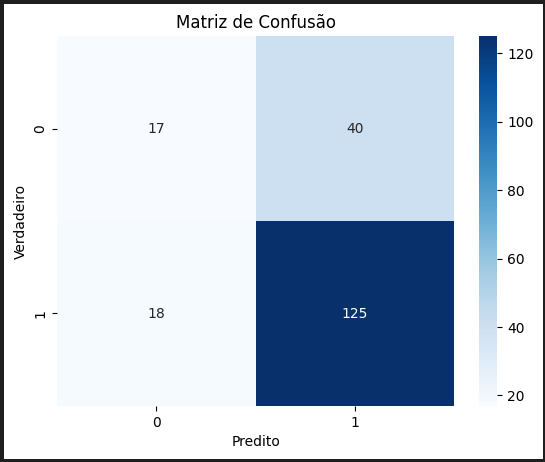

# 📘 Projeto de Machine Learning – C318

## Previsão de Desempenho Escolar com Base em Fatores Socioeconômicos

**Alunos:** Ana Julia Pinto e Luís Eduardo Mendes de Carvalho
**Disciplina:** Tópicos Especiais II – Fundamentos de Machine Learning
**Tema:** Classificação binária – Aprovado ou Reprovado com base em dados educacionais
**Fonte de dados:** [Students Performance Dataset (Kaggle)](https://www.kaggle.com/datasets/spscientist/students-performance-in-exams)

---

## 📌 1. Objetivo do Projeto

Nosso objetivo foi desenvolver um modelo de machine learning capaz de prever se um aluno será aprovado ou reprovado com base em variáveis socioeconômicas e de contexto escolar, como:

* Gênero
* Tipo de almoço fornecido
* Escolaridade dos pais
* Curso preparatório para o teste
* Grupo étnico

A classificação é binária: consideramos um aluno aprovado se a média das três notas (matemática, leitura e escrita) for maior ou igual a 60.

---

## 🧐 2. Formulação do Problema

* Tipo de Aprendizado: Supervisionado
* Tarefa: Classificação
* Variável alvo (target): aprovação (1 para aprovado, 0 para reprovado)

---

## 📅 3. Coleta de Dados

O conjunto de dados contém informações de 1000 estudantes e inclui as seguintes colunas principais:

* Gênero (masculino ou feminino)
* Grupo étnico (grupos A a E)
* Escolaridade dos pais (níveis variados)
* Tipo de almoço (padrão ou gratuito/reduzido)
* Participação em curso preparatório
* Notas de matemática, leitura e escrita

---

## 🧼 4. Pré-processamento

Etapas realizadas:

* Criação da variável `media`: média aritmética das três notas.
* Criação da variável binária `aprovado`: 1 se média ≥ 60, 0 caso contrário.
* Codificação one-hot para variáveis categóricas.
* Separação dos dados em treino (70%) e teste (30%).

---

## 📊 5. Análise Exploratória

🔵 Gráfico 1 – Distribuição de Aprovados e Reprovados:

A maior parte dos alunos foi classificada como aprovada. Isso indica um leve desbalanceamento das classes, algo que pode influenciar o desempenho do modelo.

🔵 Gráfico 2 – Distribuição da média por tipo de almoço:

Aqui percebemos uma diferença clara: alunos com almoço padrão tendem a ter desempenho melhor do que aqueles com almoço gratuito ou reduzido. Essa diferença levanta a hipótese de que fatores socioeconômicos realmente afetam o rendimento.

---

## 🤖 6. Treinamento do Modelo

* Algoritmo utilizado: Random Forest
* Métricas analisadas: acurácia, precisão, recall, F1-score e matriz de confusão

---

## 📈 7. Importância das Variáveis

🔵 Gráfico 3 – Importância das variáveis no modelo:

Surpreendentemente, o fator mais importante foi o tipo de almoço. Isso mostra como uma variável simples pode servir como indicador indireto de questões como renda familiar. O curso preparatório também teve impacto alto.

Já a escolaridade dos pais teve pouca influência no modelo — o que foi inesperado. Talvez ela não reflita diretamente o apoio educacional em casa ou esteja mascarada por outras variáveis.

---

## 📊 8. Avaliação do Modelo

🔵 Gráfico 4 – Matriz de Confusão:

A matriz mostra que o modelo acertou muitos casos de aprovação, mas teve erros importantes, principalmente falsos positivos (alunos reprovados que foram previstos como aprovados). Isso sugere que, embora o desempenho geral tenha sido bom, o modelo ainda pode ser ajustado para reduzir erros.

📀 Métricas:

* Acurácia: 84.5%
* Precisão: 75.7%
* Recall: 87.4%
* F1-score: 81.1%

Esses valores mostram um equilíbrio razoável entre os tipos de erro, mas o recall alto nos aprovados indica que o modelo está mais “generoso” em prever aprovação.

---

## ✅ 9. Conclusão

O modelo conseguiu resultados satisfatórios e demonstrou que é possível prever aprovação escolar com base em fatores externos às notas.

O destaque do tipo de almoço como a variável mais relevante nos fez refletir sobre como elementos econômicos, mesmo indiretamente, impactam o aprendizado. Isso reforça a importância de políticas públicas que ofereçam suporte alimentar e preparação escolar.

Também nos chamou atenção o fato da escolaridade dos pais não ter peso significativo. Isso pode indicar que o ambiente doméstico ou as condições de estudo importam mais do que o nível de formação dos responsáveis.